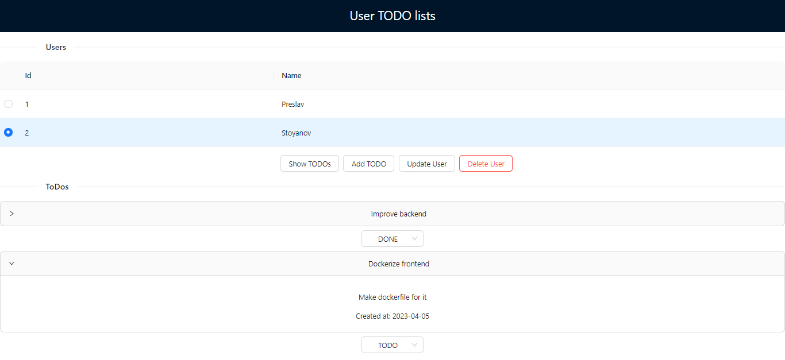

# User-ToDo React application

This project was bootstrapped with [Create React App](https://github.com/facebook/create-react-app).

## Used libraries
To run the project need to run:

`npm install`
`npm install axios`
`npm install antd`

## Available Scripts

In the project directory, you can run:

`npm start`

Runs the app in the development mode.\
Open [http://localhost:3000](http://localhost:3000) to view it in your browser.
